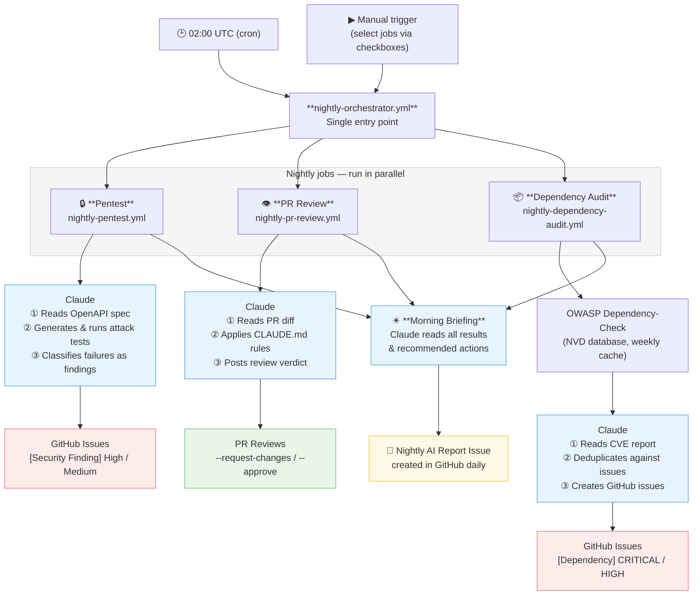

# Project: Nightly AI Jobs

A platform that uses **Claude AI as an autonomous agent** to run security and code quality jobs every night — replacing manual review cycles with AI-driven analysis that reads context, reasons about findings, and takes action directly in GitHub.

---

## The Concept

Each night Claude runs three jobs automatically:
- Attacks the payment API looking for security vulnerabilities
- Reviews every open pull request against the team's code review rules
- Scans all dependencies for known CVEs and triages the findings
- Writes a morning briefing summarising what it found and what needs attention

---

## Architecture



---

## Project Structure

```
payment-api-pentest/
├── pom.xml                                          Maven build (Java 24)
├── config/
│   └── pentest.properties                           Local config — git-ignored, fill in real values
├── api-spec/
│   ├── payment-api.yml                              OpenAPI 3.x spec — drives PentestSuite
│   ├── paymentapi-pentest-notes.md                  Session validation behaviour, code references
│   └── paymentapi-test-data.md                      Seeded payment IDs and curl examples
├── src/test/java/com/example/pentest/
│   ├── base/
│   │   ├── ConfigLoader.java                        Loads config from env vars or properties file
│   │   ├── ApiClient.java                           HTTP client with request logging (RestAssured)
│   │   └── PentestBase.java                         Shared @BeforeAll setup for all test classes
│   ├── spec/
│   │   ├── OpenApiLoader.java                       Parses OpenAPI 3.x YAML/JSON via swagger-parser
│   │   ├── ApiEndpoint.java                         Record: path, method, operationId, parameters
│   │   └── ApiParameter.java                        Record: name, in, required, type
│   ├── generator/
│   │   ├── PentestSuite.java                        @TestFactory — generates tests from spec
│   │   ├── ProbeParams.java                         Resolves per-endpoint probe values from config
│   │   ├── HappyFlowTemplates.java                  Endpoint-specific 200 assertions
│   │   ├── AuthTestTemplates.java                   sessionId, merchantId auth tests
│   │   ├── AccessControlTestTemplates.java          IDOR and cross-user session probes
│   │   ├── InjectionTestTemplates.java              SQL, XSS, oversized input per string param
│   │   └── ExposureTestTemplates.java               HSTS, X-Content-Type-Options, CORS, secret leak
│   ├── report/
│   │   ├── PentestReportSummary.java                JUnit listener → target/pentest-reports/summary.txt
│   │   └── GithubIssueReporter.java                 JUnit listener → creates GitHub issues for High/Medium findings
│   └── stripe/
│       ├── auth/AuthStripeApiKeyTest.java            API key auth tests (invalid, empty, Bearer)
│       ├── accesscontrol/BolaIdorPaymentTest.java    IDOR/BOLA, path traversal, cross-account access
│       ├── accesscontrol/MassAssignmentPaymentTest.java  Mass assignment, negative amounts
│       ├── injection/InjectionSqlPaymentTest.java    SQLi, command injection, oversized metadata
│       ├── injection/SsrfPaymentCallbackTest.java    SSRF via webhook URL registration
│       ├── ratelimit/RateLimitPaymentSubmissionTest.java  Burst requests, idempotency abuse
│       └── exposure/ExposurePanInResponseTest.java   PAN/CVV masking, security headers
├── src/test/resources/
│   ├── logback-test.xml                             Test logging config
│   └── META-INF/services/...TestExecutionListener   Registers PentestReportSummary + GithubIssueReporter
└── .github/workflows/
    ├── claude.yml                                   Claude PR assistant (@claude mentions)
    ├── claude-code-review.yml                       Claude auto code review on PRs (show_full_output: true)
    ├── nightly-orchestrator.yml                     Entry point: runs all nightly jobs; morning briefing issue
    ├── nightly-pentest.yml                          Nightly job: Payment API step + Stripe step
    ├── nightly-pr-review.yml                        Nightly job: Claude reviews all open PRs
    └── nightly-dependency-audit.yml                 Nightly job: OWASP scan + Claude CVE triage
```

---

## How test generation works

`PentestSuite` reads `api-spec/payment-api.yml` at runtime and creates a `DynamicContainer` per endpoint, each holding tests from five template classes:

```
OpenAPI spec → OpenApiLoader → List<ApiEndpoint>
                                     │
                    ┌────────────────┼──────────────────┐
                    ▼                ▼                   ▼
           HappyFlowTemplates  AuthTestTemplates  AccessControlTestTemplates
           InjectionTestTemplates  ExposureTestTemplates
```

To add or remove an endpoint from the pentest, update `api-spec/payment-api.yml` — no Java changes needed.

---

## Configuration

Tests read credentials from **environment variables** (priority) or `config/pentest.properties` (local dev fallback). Never commit real credentials — the file is git-ignored.

### Payment API config keys

| Key | Description |
|---|---|
| `PENTEST_BASE_URL` | Payment API base URL (e.g. `http://localhost:8080`) |
| `PENTEST_USER_TOKEN` | User credential (set to `unused` if not needed) |
| `PENTEST_ADMIN_TOKEN` | Admin credential (set to `unused` if not needed) |
| `PENTEST_API_KEY` | Primary API key used by `ApiClient` |
| `PENTEST_TEST_ACCOUNT_ID` | Test account ID |
| `TARGET_ENV` | `staging` (default) or `sandbox` — `sandbox` enables destructive tests |
| `PENTEST_SPEC_PATH` | Path to OpenAPI spec (default: `api-spec/payment-api.yml`) |
| `PENTEST_PROBE_PARAMS` | Global probe defaults: `merchantId=...,sessionId=...,userId=...,method=payin` |
| `PENTEST_PROBE_PARAMS_<operationId>` | Per-endpoint overrides (e.g. `PENTEST_PROBE_PARAMS_getPaymentStatus=...`) |
| `PENTEST_SKIP_OPERATIONS` | Comma-separated operationIds to skip (e.g. `createPayment`) |
| `PENTEST_IDOR_TARGET_PAYMENT_ID` | Payment ID owned by a different user — used in IDOR tests |
| `PENTEST_IDOR_TARGET_MERCHANT_ID` | Merchant ID for the IDOR target payment |
| `PENTEST_IDOR_CALLER_USER_ID` | UserId making the cross-user IDOR request |

### GitHub issue creation (nightly CI only)

| Key | Description |
|---|---|
| `PENTEST_CREATE_ISSUES` | Set to `true` to enable issue creation — disabled by default |
| `GITHUB_TOKEN` | Token with `issues: write` scope (auto-provided in Actions) |
| `GITHUB_REPO` | Repository in `owner/repo` format (use `${{ github.repository }}`) |

Only **High** and **Medium** findings create issues. Low/Info (headers, spec mismatches) are excluded.

### Stripe config keys (separate step in nightly workflow)

| Key | Description |
|---|---|
| `STRIPE_API_KEY` | Stripe test secret key (`sk_test_...`) |
| `STRIPE_TEST_ACCOUNT_ID` | Stripe customer ID for IDOR tests (`cus_...`) |

### Local setup

```bash
# Edit config/pentest.properties with your values, then:
mvn test                                        # Payment API + spec-driven tests
mvn test -Dgroups=stripe -DexcludedGroups=destructive   # Stripe tests only
```

### GitHub Actions secrets

**Repository-level** secrets (`Settings → Secrets and variables → Actions`):

```bash
gh secret set ANTHROPIC_API_KEY --body "..."          # Claude workflows (PR review, dependency audit)
gh secret set NVD_API_KEY       --body "..."          # OWASP Dependency-Check — free key at nvd.nist.gov/developers/request-an-api-key
```

**Environment-level** secrets (add under `Settings → Environments → pentest-staging`):

```bash
# Payment API
gh secret set PENTEST_BASE_URL --env pentest-staging --body "https://..."
gh secret set PENTEST_API_KEY  --env pentest-staging --body "..."

# Stripe
gh secret set STRIPE_API_KEY          --env pentest-staging --body "sk_test_..."
gh secret set STRIPE_TEST_ACCOUNT_ID  --env pentest-staging --body "cus_..."
```

---

## Running Tests

| Command | What it runs |
|---|---|
| `mvn test` | All non-destructive tests (Payment API + spec-driven) |
| `mvn test -Dgroups=stripe -DexcludedGroups=destructive` | Stripe tests only |
| `mvn test -DexcludedGroups=destructive,stripe` | Payment API tests only |
| `mvn test -Dgroups=auth` | Auth-tagged tests only |
| `mvn test -Dtest=PentestSuite` | Spec-driven suite only |
| `mvn allure:report` | HTML report → `target/site/allure-maven-plugin/index.html` |

### JUnit tags

| Tag | Scope | Classes |
|---|---|---|
| `stripe` | Stripe API tests | All 7 classes in `stripe/` |
| `auth` | Auth tests | `AuthStripeApiKeyTest` |
| `bola` | Access control | `BolaIdorPaymentTest`, `MassAssignmentPaymentTest` |
| `injection` | Injection | `InjectionSqlPaymentTest`, `SsrfPaymentCallbackTest` |
| `ratelimit` | Rate limiting | `RateLimitPaymentSubmissionTest` |
| `exposure` | Exposure | `ExposurePanInResponseTest` |
| `spec-driven` | Spec-driven suite | `PentestSuite` |
| `destructive` | Creates/modifies real data | Requires `TARGET_ENV=sandbox` |

---

## GitHub Workflows

### `nightly-pentest.yml`
- Runs at **02:00 UTC** every night; also manually triggerable from the Actions UI
- Two sequential test steps — different `env:` blocks, different targets:
  1. **Payment API** — `PENTEST_BASE_URL` secret, excludes `stripe` and `destructive`
  2. **Stripe** — `https://api.stripe.com`, runs only `stripe` tag, `if: always()` so it runs regardless of step 1 result
- Both steps have `PENTEST_CREATE_ISSUES=true` — findings create GitHub issues automatically
- Uploads artifacts for 30 days: Allure results, findings summary, Surefire XML
- Prints findings summary to the **GitHub Actions job summary tab**
- Requires GitHub Environment `pentest-staging` with `issues: write` permission

### `nightly-orchestrator.yml`
- Single entry point that runs all nightly jobs at **02:00 UTC**; also manually triggerable
- Three parallel `workflow_call` jobs: `nightly-pentest`, `nightly-pr-review`, `nightly-dependency-audit`
- **Configurable via `workflow_dispatch` inputs** — uncheck any job to skip it for a manual run; scheduled runs always execute all three
- `morning-briefing` job runs after all three complete (`if: always()`) and creates a `🌙 Nightly AI Report — YYYY-MM-DD` GitHub issue summarising results and recommended actions
- Top-level `permissions:` block sets the ceiling for all called workflows

### `nightly-pr-review.yml`
- Called by the orchestrator; also directly triggerable via `workflow_dispatch`
- **Job 1** lists all open non-draft PRs; **Job 2** reviews each in a matrix (max 3 parallel)
- Claude reads the PR diff and `CLAUDE.md` rules, then calls `gh pr review` directly:
  - `--request-changes` for any `[BLOCKING]` finding
  - `--comment` for `[ADVISORY]`/`[NIT]` only
  - `--approve` when no issues found
- Requires `ANTHROPIC_API_KEY` repository secret

### `nightly-dependency-audit.yml`
- Called by the orchestrator; also directly triggerable via `workflow_dispatch`
- Runs `mvn dependency:copy-dependencies` then `owasp:dependency-check-maven:check`
- NVD database is **cached weekly** (`~/.dependency-check/data`) — first run of each week is slow; subsequent runs restore in seconds
- Requires `NVD_API_KEY` repository secret (free at `nvd.nist.gov`) for fast NVD feed access
- Claude reads the JSON report and creates GitHub issues for HIGH/CRITICAL CVEs (deduplicates against existing issues)
- Uploads `dependency-check-report.json` artifact for 30 days

### `claude-code-review.yml`
- Triggers on every PR (`opened`, `synchronize`, `ready_for_review`, `reopened`)
- `show_full_output: true` — full Claude reasoning visible in Actions logs
- Requires `ANTHROPIC_API_KEY` secret

### `claude.yml`
- Responds to `@claude` mentions in PR/issue comments and reviews
- Can resolve merge conflicts, answer questions, or suggest improvements when mentioned

---

## Known Security Findings

### Payment API

| Finding | Severity | Endpoint | Detail |
|---|---|---|---|
| IDOR — payment status | High | `GET /payment/status/{id}` | `payment_api.go:1043` only checks `merchantId`, not `userId` |
| IDOR — payment summary | High | `GET /payment/summary/{id}` | No `userId` parameter — any caller with `merchantId` can read any payment |
| Cross-user session | Medium | All session-validated endpoints | Session not bound to `userId` at validation time |
| Empty sessionId bypass | Medium | `GET /payment-types` | `payment_api.go:222` guard skips validation when `sessionId=""` |
| CORS wildcard | Low | All endpoints | `Access-Control-Allow-Origin: *` |
| Missing HSTS | Low | All endpoints | No `Strict-Transport-Security` header |
| Missing X-Content-Type-Options | Low | All endpoints | No `nosniff` header |

### Stripe

| Finding | Severity | Detail |
|---|---|---|
| SSRF — webhook URL validation gap | Medium | Stripe accepts RFC 1918 IPs (`10.x`, `192.168.x`, `169.254.x`) at registration time; blocks delivery at network layer only |

The SSRF tests **intentionally fail** in CI to surface the finding.

---

## Development Standards

- **Java 24** — use Records, Text Blocks, Switch Expressions where appropriate
- **No hardcoded secrets** — all credentials via env vars or git-ignored properties file
- **Test naming**: `given_<precondition>_when_<action>_then_<securityOutcome>`
- **Security findings surface as hard test failures** so they appear in CI reports
- **Destructive tests gated** behind `TARGET_ENV=sandbox`
- **Stripe tests isolated** with `@Tag("stripe")` — run separately with their own credentials
- **Spec-driven tests** are generated from `api-spec/payment-api.yml` — update the spec, not the Java

---

## Code Review Rules

When reviewing changes to this repository, enforce the following.

### Severity labels
Apply one of these labels to every finding so the author knows what must be fixed before merge:

| Label | Meaning |
|---|---|
| **[BLOCKING]** | Must be fixed before merge — security vulnerability, broken CI, data loss risk |
| **[ADVISORY]** | Should be addressed soon but does not block merge — code quality, missing edge-case coverage |
| **[NIT]** | Optional — style, naming, minor readability |

Post a top-level summary at the end of the review: `APPROVE`, `REQUEST_CHANGES` (if any BLOCKING finding exists), or `COMMENT`.

### Security
- **No secrets in source** — reject any hardcoded API keys, tokens, passwords, or UUIDs that look like real credentials. Placeholder values (`unused`, `demo-key`) are acceptable.
- **No overly broad CORS** — `Access-Control-Allow-Origin: *` must not be added to authenticated endpoints.
- **Input validation at boundaries** — new endpoints must reject missing required parameters with 4xx, not silently ignore them.
- **IDOR checks must include ownership** — any DB query fetching a resource by ID must also check the owner (`userId` or equivalent), not just the tenant (`merchantId`).
- **Session validation must not be bypassable** — guard conditions using `&&` on `sessionId` and `userId` allow bypass when either is blank; use early rejection instead.

### Test quality
- **New endpoints must have tests** — any new operationId in `payment-api.yml` gets automatic coverage from `PentestSuite`; hand-written tests must cover happy path, missing auth, and at least one injection payload.
- **Failing tests must be intentional** — tests that are expected to fail (staging-only findings) must have a `NOTE:` in the assertion message explaining why.
- **No `assumeTrue(false)` without explanation** — skipped tests must document what infrastructure is missing and what the test would verify.
- **Probe params must be realistic** — use seeded IDs from `api-spec/paymentapi-test-data.md`, not UUIDs invented in the test code.

### CI / workflow
- **Issue creation must remain opt-in** — `PENTEST_CREATE_ISSUES=true` must only appear in `nightly-pentest.yml`, never in PR or branch workflows.
- **Stripe and Payment API steps must stay separate** — they cannot share `PENTEST_BASE_URL`; adding a third target requires a new step with its own `env:` block.
- **`if: always()`** must be set on the Stripe step so payment API failures do not suppress Stripe results.
- **Surefire includes** — all test classes must end in `Test` to be discovered by the JUnit Platform provider. The `**/*Suite.java` Surefire pattern does not work with JUnit Platform's class discovery.
- **Use explicit `-Dgroups` not exclusion-only `-DexcludedGroups`** — with exclusion-only tag filters, JUnit Platform silently drops untagged `@TestFactory` classes from the test plan. Always pair a `@Tag` on the class with a matching `-Dgroups=<tag>` in the Maven command. The Stripe step (`-Dgroups=stripe`) works; the Payment API step must use `-Dgroups=spec-driven` for the same reason.

### Code style
- **Records over POJOs** — use Java records for immutable data carriers (`ApiEndpoint`, `ApiParameter`, `Failure`).
- **Switch expressions over if-else chains** — use `switch (operationId)` in template classes; add a `default -> {}` branch explicitly.
- **No checked exceptions in test helpers** — wrap in `RuntimeException` or use `assertDoesNotThrow`; checked exceptions in `@TestFactory` lambdas break the test tree silently.
- **Template classes must be `final` with private constructors** — they are stateless utility classes, not meant to be instantiated or extended.
- **`var` for local variables** — use `var` instead of explicit types where the type is obvious from the right-hand side (e.g., `var list = new ArrayList<String>()` not `ArrayList<String> list = ...`).
- **Immutable collections** — use `List.of()`, `Map.of()`, `Set.of()` for fixed-size collections; never `new ArrayList<>()` or `new HashMap<>()` when the collection is not mutated after creation.
- **No `System.out.println`** — use SLF4J (`log.info(...)`, `log.warn(...)`) for all logging; bare print statements are invisible in CI and pollute test output.
- **Streams over imperative loops** — prefer `stream().filter().map().collect()` over `for`-loops that accumulate into a mutable list; exception only when stream legibility suffers.
- **No magic numbers** — extract numeric literals that encode business meaning into named constants (`private static final int MAX_RETRIES = 3`); raw literals in assertions are acceptable only when self-evident (e.g., `200`, `404`).